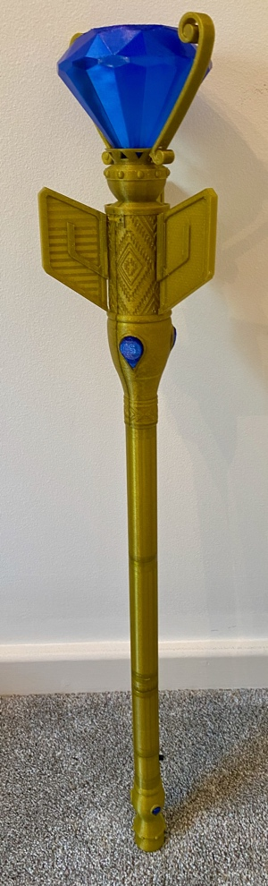

# Scepter of Light
## 3D printable prop

*Phil McCarthy, August 2021*

**What is this?**
A 3D printed version of the Scepter of Light from Elena of Avalor, created by Phil McCarthy over summer 2021.

**Why?**
My daughter loves Elena, and wanted a scepter to go with her costume. I've wanted to have a go at designing a circuit board and do some 3D printing for a while, so thought it would be a good project.

The scepter lights up and plays music when turned on, and rumbles with "magic" when waved. See a quick [video demo here](https://youtu.be/RlnO9K1_UK8).

**What's included in this repository?**
Original OpenSCAD designs and related assets for all parts, STL files for unmodified reprints, KiCAD project files and gerbers for modifying/fabricating the PCB, and documentation.

See docs/BOM.md for the full parts list, docs/assembly.md for assembly instructions, and docs/printing.md for the print settings that worked for me when printing the parts out.

**Any gotchas?**

I haven't included wav sound files for potential copyright reasons. You just need to find some appropriate sounds and save them as "theme.wav" and "blaze.wav" on the root of the SD card that slots into the microcontroller.

The GY-521 gyro module needs to be mounted onto the PCB upside down, due to a mistake in the PCB design - this is documented in the assembly instructions.

I'm a bit worried the vibration motor doesn't have a capacitor and reverse diode in parallel to it - I thought I didn't need this as the ULN2003 already has free-wheeling diodes, but there's a chance negative voltage spikes could find their way to the I2S amp module (the MCU is protected with a shottky, and the gyro is powered direct from the MCU). I've had no problems so far, this is just an academic concern.

**What's the future of the project?**

I plan to add gesture recognition at some point - the MCU was chosen to be powerful enough to support machine learning and classification of accelerometer data.

I'm not sure when I'm going to get round to coding it in; it might be next year. If you want to implement this yourself, go for it - I'm excited to see what you do!

### Legal stuff
This project is a fan-made artistic prop, not a commercial product, and is offered free and open source. The PCB design, 3D print designs and MCU firmware are offered under the [GPLv3 license](https://www.gnu.org/licenses/gpl-3.0.en.html).
In particular note the warranty and liability sections - these designs are offered for you to do what you want with them, with the understanding that if they cause harm or damage to you, your property or your loved ones, you and solely you take full responsibility.

