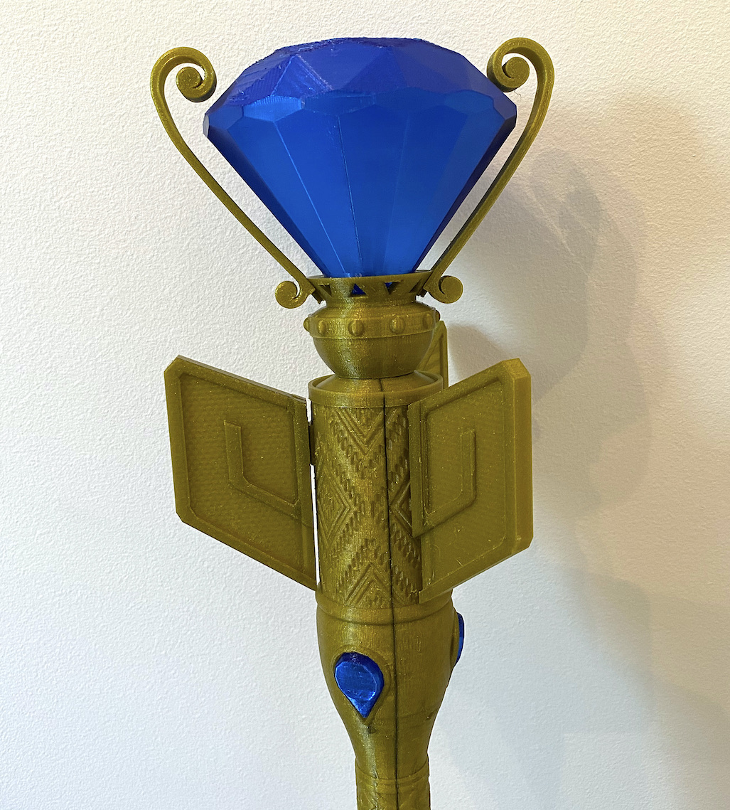
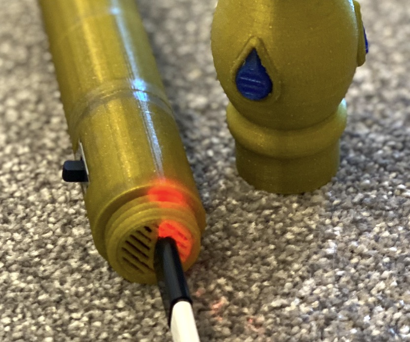
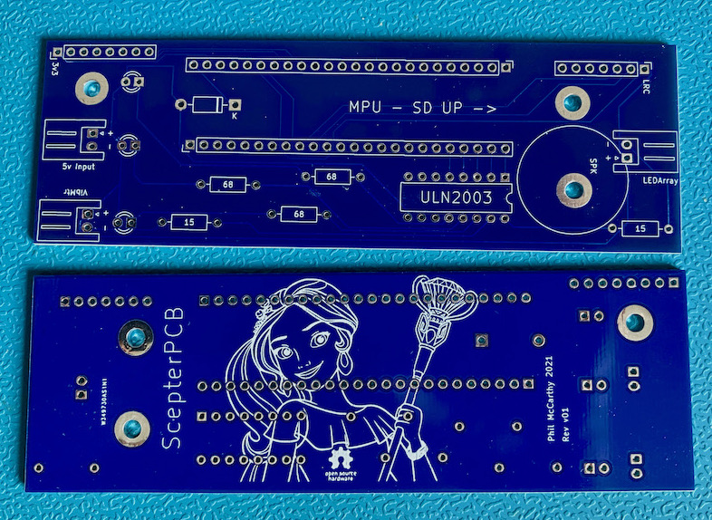

# Scepter of Light
## 3D printable prop

*Phil McCarthy, August 2021*

### What is this?
A 3D printed version of the Scepter of Light from Elena of Avalor, created by Phil McCarthy over summer 2021.

### Why?
My daughter loves Elena, and wanted a scepter to go with her costume. I've thought about designing a circuit board and doing some 3D printing for a while - so this was an ideal learning project with the right level of challenge. It took about three months to complete in my spare time.

The scepter lights up and plays music when turned on, and rumbles with "magic" when waved. See a quick [video demo here](https://youtu.be/RlnO9K1_UK8).

I've made [an Instructable](https://www.instructables.com/Scepter-of-Light/) and [a Thing](https://www.thingiverse.com/thing:4937785) to go with this repository, to make it more searchable.

### Features

- Easy access charging via MicroUSB port in unscrewable hilt - red light is charging, blue means charged. Grille around port allows heat dissapation during charge. 

- Custom PCB with ULN2003A driver allows independent control of each of the three side ultrabright LEDs, the top ultrabright LED array, and the vibration motor, via the MCU's output pins.

  

- All components on the PCB board are through-hole, allowing easy soldering/assembly, but it's thin enough to fit into the 50mm diameter scepter head.

- High spec Teensy 4.1 MCU with 600 MHz Cortex-M7 processor and 1MB RAM can support gesture recognition via ML (in future).

### What's included in this repository?
Original OpenSCAD designs and related assets for all parts, STL files for unmodified reprints (also Prusa project files which will save you time when slicing if you have a Prusa), KiCAD project files and gerbers for modifying/fabricating the PCB, and documentation.

Included in the documentation is [the full parts list](docs/BOM.md), [assembly instructions](docs/assembly.md), and [the printing settings that worked for me](docs/printing.md) when printing the parts out.

### Any gotchas?

I haven't included wav sound files for potential copyright reasons. You just need to find some appropriate sounds and save them as "theme.wav" and "blaze.wav" on the root of the micro SD card that slots into the microcontroller.

The GY-521 gyro module needs to be mounted onto the PCB upside down, due to a "feature" in the PCB design - this is documented in the assembly instructions.

The sound isn't super-loud. It's acceptably audible, but not room filling. This is because there's little space in the enclosure interior, so I had to opt for a thin 8ohm 0.5W 20mm speaker. As a result the default 9dB gain setting of the MAX98357 distorts the audio through this speaker. I reduced the gain to 6dB by connecting the GAIN pin to Vin, which results in non-distorted (but slightly quieter) audio.

If you have some way of mounting a larger, more powerful speaker (up to 3W), it's possible to get these different gain settings:  

- **15dB** if a 100K resistor is connected between **GAIN** and **GND**
- **12dB** if **GAIN** is connected directly to **GND**
- **9dB** if **GAIN** is not connected to anything
- **6dB** if **GAIN** is connected directly to **Vin** (default PCB wiring)
- **3dB** if a 100K resistor is connected between **GAIN** and **Vin**

You will need to hack the PCB with a craft knife and soldering iron or update the PCB design to achieve these changes.

### What's the future of the project?

I plan to add gesture recognition at some point - the MCU was chosen to be powerful enough to support machine learning and classification of accelerometer data.

I'm not sure when I'm going to get round to coding it in; it might be next year. If you want to implement this yourself, go for it - I'm excited to see what you do!

### Legal stuff
This project is a fan-made artistic prop, not a commercial product, and is free and open source. The PCB design, 3D print designs and MCU firmware are shared under the [GPLv3 license](https://www.gnu.org/licenses/gpl-3.0.en.html).

In particular note the warranty and liability sections - these designs are shared for you to do what you want with them, with the understanding that if they cause harm or damage to you, your property or your loved ones, **you and solely you take full responsibility**.

High capacity Lithium Ion batteries are **dangerous**, should *never* be short circuited, and must be used with care and knowledge. **Please don't assume my circuitry or designs are electrically or mechanically safe.**
