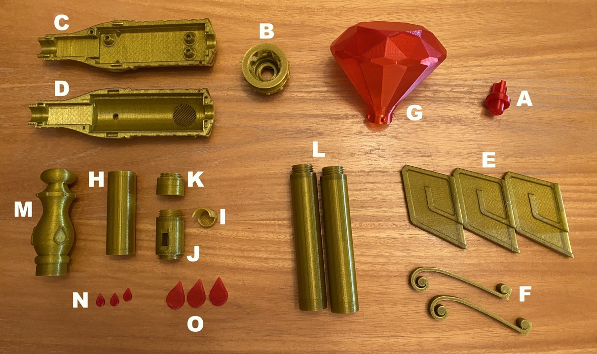
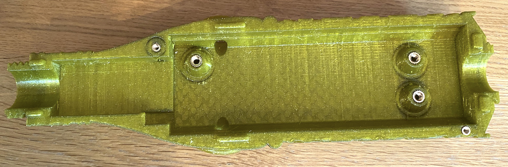
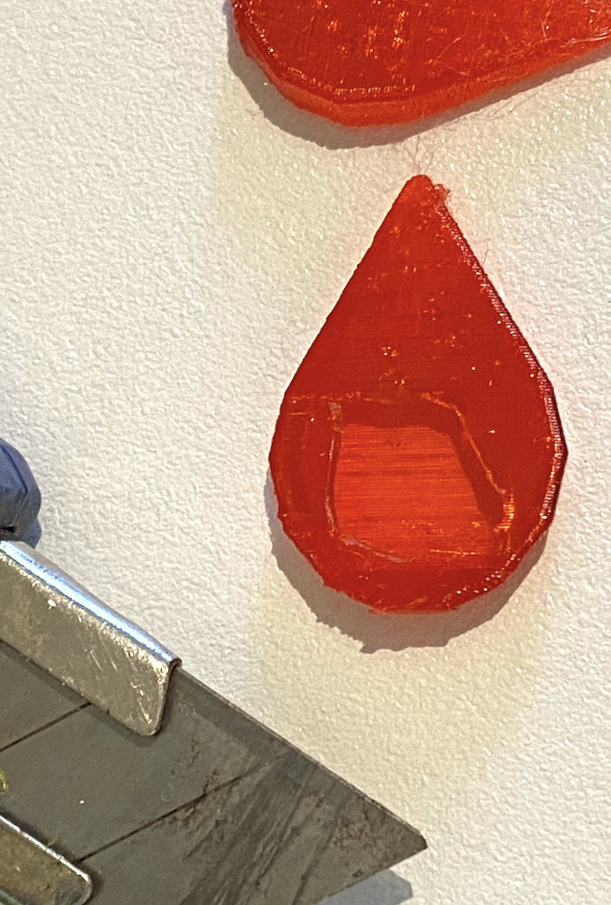

# Scepter of Light
## 3D printable prop

*Phil McCarthy, August 2021*

### Assembly instructions

See [the BOM](../docs/bom.md) for the list of components required to complete this build. You will also need:

- A soldering iron
- Wire cutters
- Pliers
- A drill
- A multimeter
- Superglue (I used Araldite)
- Gluegun

#### 1. Fabricate PCB

Get the PCB fabricated from a board house using the [gerber files](../pcb/sofpcb_rev01_gerber.zip) (I used [PCBWay](https://www.pcbway.com), they were fairly priced and efficient), and wait two weeks for them to arrive. There's typically a 5 board minimum order.

#### 2. Print parts

Print the STL files. [These are the settings](../docs/printing.md) I found worked for me. Use different settings if they work better for you or your printer. I used [gold filament](https://shop.prusa3d.com/en/prusament/958-prusament-petg-yellow-gold-transparent-1kg.html) for the scepter body parts, and [transparent blue](https://www.amazon.co.uk/gp/product/B07T7MBGVL/ref=ppx_yo_dt_b_search_asin_title?ie=UTF8&psc=1) for the gems. In about a week you should have the following printed parts (red shown instead of blue in photo):

- A: LED stalk (blue)
- B: Thistle
- C: Left head
- D: Right head
- E: 3 wings
- F: Top gem curls (gold)
- G: Top gem
- H: 18650 battery case
- I: TP4056 sleeve
- J: Neg terminal screw with switch mount
- K: Pos terminal screw
- L: 2 shaft sections
- M: Hilt
- N: 3 hilt gems
- O: 3 head gems

#### 3. Assemble LED stalk

Take the LED stalk (A), and 3 of the LEDs. Twist the short leads (cathodes) together, and solder on a black wire (long enough to reach the PCB bay below). Solder 3 wires to each of the anodes. 

Thread the LED wires through the holes at the top of the LED stalk, black wire in the center, until the LEDs sit flush with the top. Take care that none of the anode leads are left touching the joined cathode lead.

At the base of the stalk, cut, bare and twist the three anode wires together, and solder to them a single positive wire. Put a JST-XH plug on the end of the two stalk wires (note polarity of pcb header).

Screw the stalk into the interior of the Thistle (B). 

#### 4. Prepare scepter head

Set your soldering iron to 300 degrees Celcius. Take the M2 and M3 brass inserts and seat them into the corresponding holes in the left head part (C); M2 inserts in top right and bottom left holes, M3 inserts in each PCB standoff hole. Touch the soldering iron tip to each brass insert in turn, pushing it down into the melting plastic. Stop at the last mm, then quickly use a small piece of flat metal to push the inserts fully in, so they sit flush.

#### 5. Solder components onto PCB

Set your soldering iron back to your preferred temperature - mine is at 350 degrees Celcius. Take your PCB and thread the resistors and shottky diode (cathode on "K" label) through the corresponding holes (see ohm numbers on board for where the resistors go). Turn over and solder to the board. Trim the leads with wire cutters.

Solder on the ULN2003 chip (semi-circle indent up), and all the pin headers. Use a **vertical** instead of right angle 2 pin JST header for the vibration motor connector, due to lack of space in the enclosure. Your PCB should look like the picture below: 

Solder a 2 pin vertical JST header on the center LED footprint (just above the "5V Power In" JST header), facing up. Create a detachable LED cable for this header by soldering a black and red wire to the cathode and anode leads of an LED respectively. Put a JST-XH plug onto the cable (noting the polarity of the LED header).

#### 6. Setup MCU

Solder male pin headers onto the Teensy MCU. Copy your "theme.wav" and "blaze.wav" sound files onto the root of a micro SD card, and put it into the Teensy's SD slot. Install the [Teensyduino](https://www.pjrc.com/teensy/teensyduino.html) IDE onto your computer, open up the firmware/sol_firmware/sol_firmware.ino sketch and build it (press the "Verify" button). Ignore any compiler warnings. Plug a micro USB cable from the computer into the Teensy. Press the white button on the Teensy to flash the compiled sketch to the MCU. Remove the cable.

#### 7. Mount PCB in scepter head enclosure

Thread 2 LEDs through the underside of the PCB at the corresponding LED footprints at the bottom of the board - long anode lead towards the PCB bottom (where the power connector is).

Place the PCB onto the standoffs in the enclosure bay, so that the 2 LEDs just poke out of the bottom gem seat holes. Solder them in position and trim the leads with wire cutters.

Screw M3 nylon screws into the standoffs to secure the PCB in place.

Solder male pin headers onto the MAX98357A amplifier module (also solder included terminal block) and GY-521 gyro module - solder the header onto the GY-521 **front** rather than back (the PCB design has a "feature" where the GY-521 needs to be mounted upside-down. This doesn't affect anything other than my pride). Solder wires onto a mini-speaker and screw them into the correct holes in the MAX98357A's terminal block.

Solder a female JST-SM connector to the "in" pads of the voltage regulator module and JST-XH connector to the "out" pads. Use a 3.7v power source to supply power to the module. Set your multimeter to measure voltage and touch its probes to the output terminals. Turn the flat screw on the trimmer pot until an output of around 5v is achieved. Place the module in the voltage regulator bay and connect it to the PCB.

Crimp a JST-XH plug onto the leads of a vibration motor (noting polarity) and connect it to the corresponding pin header on the board. Push the Teensy, MAX98357A and GY-521 into the corresponding female pin headers on the PCB. Your enclosure should now look like this: 

Seat the vibration motor vertically into the circular cut-out next to the PCB, and glue it into place with a glue gun. Glue the voltage regulator module in position, and put a dab of gluegun glue around the trimmer pot screw, so that it doesn't twist over time with vibration or shock.

Take the right head part (D), enclosure side up, and put it next to the left head part. Place the LED on the lead into the gem seat hole on the right head part, so that it is just poking through to the outside. Gluegun it into position.

#### 8. Assemble battery module

Take an 18650 holder, butcher it with wire cutters and carefully remove the two metal battery contacts. It will be cheaper and better for the environment to order the battery contact parts directly, but 

1. I don't know what part number they are / which supplier to source them from, and
2. I had the holders spare when I was planning to use them directly in the design.

Use pliers to bend the pins at the base of the battery contacts back (away from the prong) 90 degrees.

Take one of the contacts and solder a red wire to the pin - it should be long enough to reach the length of the battery case part (H) and negative plug part (J) together, plus a little more. Thread the wire through the pin hole on the outside of the positive plug part (K), until the battery contact sits flush on the outer surface of the plug. Take a soldering iron and touch it briefly to the contact, so the thermoplastic around it melts slightly, securing it in place. The image below shows the positive terminal with red wire looped back through a wire run hole for illustrative purposes - don't loop it back yet.

Optionally put superglue in the positive plug screw (gluing the battery module parts and shaft parts together increases material strength when the scepter is being waved around!), and screw it tight into the battery case part (H), until the three cable runs align. Carefully put an 18650 battery into the battery case, so the positive end touches the positive battery contact.

Take the other metal battery contact and do the same with the negative plug screw part (J), so that a fairly short black wire is soldered to the contact, threaded through the pin hole, and the contact is secured to the outer surface of the plug using melted plastic. 

Again, optionally put superglue around the plug, then screw it tight into the open end of the battery case part (H), until the three cable run holes align.

Loop the red wire back on itself and thread it through one of the cable run holes, so it comes out inside of the negative plug part. Take the red and black battery wires, trim and bare them, and solder them to the TP4056 module's "battery +" and "battery -" pads.

Take the slide switch, and solder a short red wire to the middle pin. Thread it through the switch cutout hole of the negative plug part, and solder to the "out +" pad of the TP4056 module. Cut red and black wires long enough to reach across the battery module and two shaft sections, with a bit of room to spare. Thread the long red wire into a cable run in the positive plug part (K), through the side of the battery case, and out of the negative plug part (J). Thread it out of the switch cutout, and solder it to the switch's top pin. Thread the long black wire into the remaining cable run in the positive plug part (K), through the side of the battery case, and out of the negative plug part (J). Solder it to the "out -" pad of the TP4056 module.

Take the ends of the long red and black wires, and use your multimeter to test that 3-4.2V is present when the slide switch is at the "on" position, and 0v when at the "off" position. Enure the switch is off, then crimp a JST-SM male plug onto the end of the cable.

Put superglue along the inner edge of the TP4056 sleeve, and slide the TP4056 module into it - the sides of the module should be glued to the sleeve, and the micro USB socket should be accessible through the hole in the grille. Put superglue at the top of the switch cutout, and around the sides of the slide switch. Push the switch down into the cutout. Put superglue around the outer semi-cylindrical surface of the TP4056 sleeve, and push it into the negative plug part (J), until the sleeve face is flush to the screw plug hole. Leave overnight for the glue to dry.

#### 9. Complete the assembly

Take the shaft sections (L) and screw them together. Thread the long JST-SM power cable through them, and screw the positive battery module to the shaft sections. Optionally superglue all these shaft screw joints.

Superglue the hilt gems (N) into the seat positions in the hilt part (M). Screw the hilt onto the micro USB recharging port plug (**don't glue the hilt on - the recharge port is meant to be accessible!**).

Take the left head part (C) with thitle and LED stalk parts (B and A) connected to the installed PCB, and the right head part (D) connected to the PCB by the top side gem LED cable. Fit the right head part onto the left head part, so the lugs fit together, taking care not to trap any cables. Take the longer M2 bolt and screw it into the hole below one of the side tear gems. Screw the other M2 bolt into the screw hole at the top of the scepter head.

Carefully screw the thistle one turn onto the scepter head, taking care not to dislodge the cable.

Take the hollow head tear gem parts (O), and drill small (2mm) holes in the wider part of their flat back surfaces, taking care not to mark the inside surfaces of the gem fronts. Take a craft knife and cut from each hole to the outer edge. Cut openings large enough for the LEDs to poke into.

Put a dab of superglue on each side gem seat on the scepter head, and push the side gems into their seats. Take each wing part (E) and place the rectangular opening onto a wing clip ('V' connector) on the scepter head. Carefully slide/work the wing part down until the wing is secured over the textured part of the head (the wing join is designed to flex a small amount and should not snap if you're careful).

Take the top gem part (G) and place it into the thistle part (B) so the bayonet connector bumps slide down into the grooves.

Twist the gem slightly so the bayonet connector bumps hold the gem in position. Slide the gem curl parts (F) onto the 'V' clips either side of the thistle top.

 

Connect the shaft and head power lead JST-SM connectors together. Poke the cable and connector down into the shaft, and screw the shaft to the bottom of the head reasonably tight. I'd recommend against supergluing this screw joint as you may need to service the electronics in the head enclosure.

This completes assembly of your Scepter of Light.
